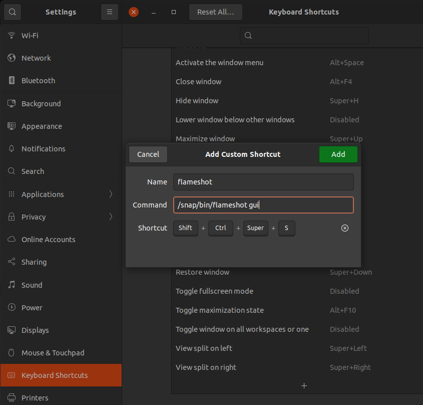

# [Nuphy Air75](https://nuphy.com/products/air75)

## Configure Nuphy Air75 (Mac Mode Remap) for Ubuntu/Linux

The following guide is to configure Nuphy Air75 using Mac Mode Remap under Ubuntu/Linux for developers who need latin accents and symbols.

### Set keyboard layout

Select the appropiate keyboard layout

Settings -> Regions & Language -> Input Source -> Keyboard Layout: English (intl, with AltGr dead keys) ~ International keyboard (with AltGr dead keys)

### Change Function Key behavior "Enable Function keys used as first key"

- [AppleKeyboard](https://help.ubuntu.com/community/AppleKeyboard)
- [keyboard-function-keys-linux](https://github.com/adam-savard/keyboard-function-keys-linux)

| 'fn' key behavior | Description                                                                                                                            |
|-------------------|----------------------------------------------------------------------------------------------------------------------------------------|
| 0 = disabled      | Disable the 'fn' key. Pressing 'fn'+'F8' will behave like you only press 'F8'                                                          |
| 1 = fkeyslast     | Function keys are used as last key. Pressing 'F8' key will act as a special key. Pressing 'fn'+'F8' will behave like a F8.             |
| 2 = fkeysfirst    | Function keys are used as first key. Pressing 'F8' key will behave like a F8. Pressing 'fn'+'F8' will act as special key (play/pause). |

```sh
echo -n 2 | sudo tee /sys/module/hid_apple/parameters/fnmode 
echo 'options hid_apple fnmode=2' | sudo tee  /etc/modprobe.d/hid_apple.conf
sudo update-initramfs -u -k all
```

The **update-initramfs** command is used in Linux systems to update the initial RAM file system (initramfs) for one or more specified kernel versions. The initramfs is a temporary file system that is loaded into memory during the Linux kernel boot process. It contains essential files and scripts required to mount the root file system and complete the boot process.

Putting it all together, the command **update-initramfs -u -k all** is telling the system to regenerate the initramfs for all installed kernel versions. This is commonly used after a kernel update or when changes to the system configuration require an update to the initramfs to ensure a successful boot process.

### Set up [ComposeKey](https://help.ubuntu.com/community/ComposeKey)

### Add [XCompose](https://wiki.debian.org/XCompose) Shortcuts for Latin combinations

1. Make sure that ibus is running and configured to input XCompose combinations

    ```sh
    pkill -o ibus-daemon
    ```

2. Edit XCompose file and add combinations

    - [gist](https://gist.github.com/kljohann/67cb8c78758af17f0710693f35dc8888)

    ```shell
    cat << EOF > ~/.XCompose # XCompose: Shortcuts Latin Accents and symbols
    include "%L"

    <Multi_key> <n> : "ñ"
    <Multi_key> <N> : "Ñ"
    <Multi_key> <a> : "á"
    <Multi_key> <A> : "Á"
    <Multi_key> <e> : "é"
    <Multi_key> <E> : "É"
    <Multi_key> <i> : "í"
    <Multi_key> <I> : "Í"
    <Multi_key> <o> : "ó"
    <Multi_key> <O> : "Ó"
    <Multi_key> <u> : "ú"
    <Multi_key> <U> : "Ú"
    EOF
    ```

3. Run ibus restart

    ```sh
    ibus restart
    ```

The ibus restart command is used to restart the IBus (Intelligent Input Bus) daemon on a Linux system. IBus is an input method framework that allows users to input text in multiple languages and switch between different input methods (such as keyboard layouts or input methods for non-Latin scripts).

When you execute **ibus restart**, it stops the currently running IBus daemon and then starts it again. This can be useful in situations where there are issues with the input method or if you've made changes to IBus configuration that require a restart to take effect

## Configure [Nudelta](https://github.com/donn/nudelta)

Install Open Source NuPhy firmware

1. Create binaries from Docker Container

    ```sh
    #!/usr/bin/env bash

    git clone https://github.com/donn/nudelta nudelta-repo
    cd nudelta-repo
    git submodule update --init --recursive
    rm -rf build
    IMAGE=nudelta
    CONTAINER=ephemeral
    docker build -t  ${IMAGE} . 
    docker run -d --name ${CONTAINER}  ${IMAGE}
    docker cp ${CONTAINER}:/nudelta/dist/nudelta-0.7.4.AppImage ../
    docker cp ${CONTAINER}:/nudelta/build/nudelta ../
    docker rm -f ${CONTAINER}
    docker image rmi  ${IMAGE}
    cd ..
    rm -rf nudelta-repo
    ```

2. Execute nudelta.AppImage

    ```sh
    ./nudelta.AppImage
    ```

    Then run this command:

    ```sh
    echo 'KERNEL=="hidraw*", SUBSYSTEM=="hidraw", TAG+="uaccess"' | sudo tee /etc/udev/rules.d/70-nudelta.rules && sudo udevadm control --reload-rules && sudo udevadm trigger
    chmod +x nudelta && sudo mv nudelta /usr/local/bin/nudelta
    ```

3. Load a custom profile using nudelta cli

    The configuration .yml file is simple: there's a top level object called "keys": which is a map of physical keys on the actual keyboard to their replacements:

    ```sh
    nudelta -l ./peter_remap.yml
    ```

    ```yml
    keys:
      capslock: esc
      lalt: lmeta
      lmeta: lalt
      ralt: rmeta
      screenshot:
        key: s
        modifiers: [meta, shift]
      assistant: f14 # f13 opens settings in gnome
      missioncontrol:
        key: enter
        modifiers: [ctrl, shift]
      launchpad:
        key: l
        modifiers: [ctrl, shift]
    mackeys:
      screenshot:
        key: s
        modifiers: [meta, shift]
      assistant: fnspace

      # unintuitively, f5 and f6 are overridden by the keyboard in mac mode
      # for backlight controls
      f5: f5
      f6: f6
    ```

    - ⌘ is the Command or Cmd or Meta key.
    - ⌃ is the Control or Ctrl key.
    - ⌥ is the Option or Alt key.
    - ⇧ is the Shift key.

4. Reset kepmap

  ```sh
  nudelta -r # Reset keymap to default in case of misconfiguration
  ```

### Bonus

#### Set Flameshot keyboard shortcut

- Shortcut: Ctrl + Cmd + screenshot



#### Create and Activate custom keymap table with [Xmodmap](https://wiki.archlinux.org/title/xmodmap)

```sh
# Get the current Keymap table
xmodmap -pke
```

```sh
# Create Custom table
# ~/.Xmodmap
keycode 37   = Super_R NoSymbol Super_R
keycode 134  = Multi_key NoSymbol Multi_key
```

```sh
# Activating the custom table
# Add in ~/.zshrc
[[ -f ~/.Xmodmap ]] && xmodmap ~/.Xmodmap
```

#### Get keyboard  key codes and key symbols through [xev](https://manpages.ubuntu.com/manpages/xenial/man1/xev.1.html)

```sh
  xev | awk -F'[ )]+' '/^KeyPress/ { a[NR+2] } NR in a { printf "%-3s %s\n", $5, $8 }'
```

* This command is a combination of two Unix command-line utilities, xev and awk, used to capture and process X Window System events related to key presses. Let's break down the command step by step:

* xev: This command is used to monitor X server events. It opens a window and displays information about X events, including keyboard and mouse events. When you run this command, you typically need to perform some actions (e.g., pressing keys) in the window that it opens to generate event information.

* |: This is a pipe operator that takes the output of the command on the left (xev in this case) and uses it as input for the command on the right (awk in this case).

* awk -F'[ )]+': This part starts the awk command. The -F option is used to specify the field separator. In this case, the field separator is set to a regular expression [ )]+, which means one or more occurrences of either space or closing parenthesis ). This is used to split the input lines into fields.

* '/^KeyPress/ { a[NR+2] }': This is an awk pattern-action statement. It specifies a pattern /^KeyPress/ which matches lines that start with the string "KeyPress". When such a line is encountered, the associated action { a[NR+2] } is executed. This action adds the value of the line number (NR) plus 2 as an index to the array a. In other words, it keeps track of line numbers that are two lines after lines starting with "KeyPress".

* NR in a { printf "%-3s %s\n", $5, $8 }: This is another awk pattern-action statement. It specifies a pattern NR in a, which matches lines where the line number (NR) is found in the array a. When such a line is encountered, the associated action { printf "%-3s %s\n", $5, $8 } is executed. This action prints formatted output, where $5 and $8 refer to the fifth and eighth fields, respectively, based on the specified field separator. The printed output includes the fifth field (presumably representing a key code) and the eighth field (presumably representing the corresponding key symbol).

> In summary, the entire command captures X server events related to key presses using xev, processes the output with awk to extract information about key presses, and prints formatted output containing key codes and key symbols. The specific details of the output depend on the actual events generated by interacting with the xev window.
